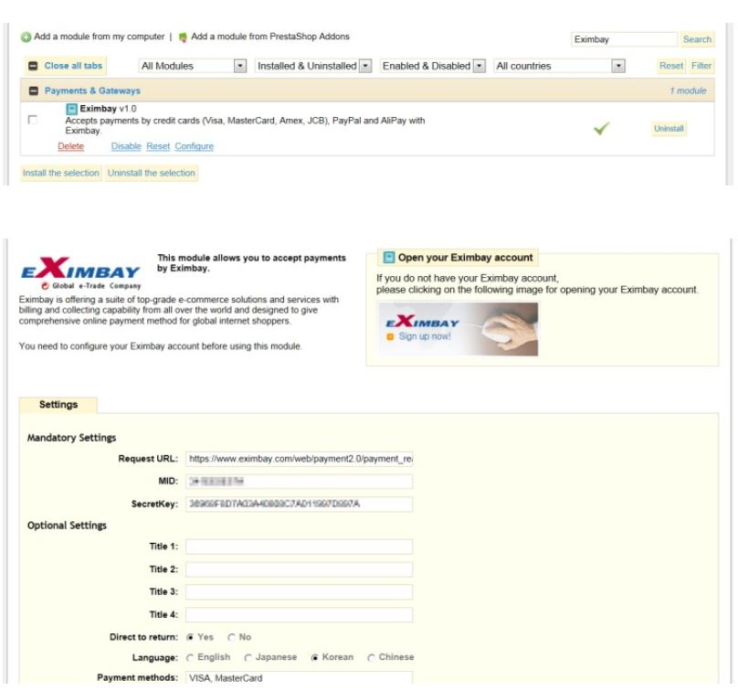
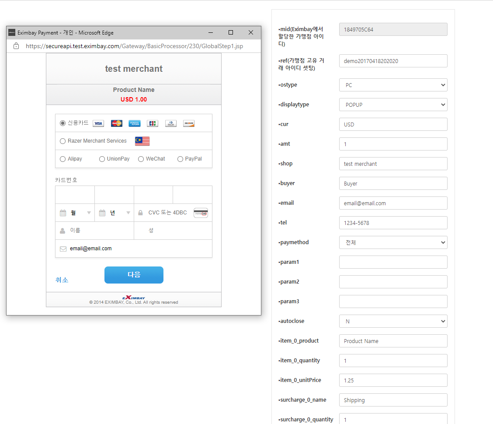

# Eximbay

# 0. 서비스 신청

- 가입비O, 심사과정 필요, 안정적+한국법인 존재


# 1. 기능

- 해외에 사업자가 없는 국내 기업은 PG 가입방법 없음 => eximbay는 한국 법인 존재/ 사업자번호 필요

- eximbay와 계약하면 유럽의 카드 회사와 paypal, alipay_무료 도 지원 가능

- pc와 모바일 파라미터 동일한 양식으로 넘길 수 있어서 좀 더 쉽게 결제 모듈 사용 가능

- 요청 파라미터 알파벳 순으로 sort하여 secret_key와 ?로 연결하여 sha256으로 해시한 값을 따로 담아서 같이 보내줘야 함

- ISO-8859-1 필수_HTML4 인코딩 타입

  

## 1) 결제

- 국내
  - 롯데, 비씨, 신한, 하나, 현대, 국민, 농협, 삼성)와 TOSS / KakaoPay / PAYCO
- 해외
  - 

## 2) 환불


## 3) 결제 확인

| 필드       | 설명                                                   |
| ---------- | ------------------------------------------------------ |
| SALE       | 정상 매출(매출 확정)                                   |
| AUTH       | 승인 거래(매출 미확정, Capture_결제 승인 시 매출 확정) |
| REGISTERED | 주문 등록(매출 미확정, 입금 통지시 매출 확정)          |
| NONE       | 거래 없음                                              |


# 2. 개발 

## 1) 개발환경

- 개발 언어: jsp 또는 php, python으로 포팅 가능
- framework: fast API

- 무료 모듈 테스트 진행

> **[Eximbay 홈페이지](https://www.eximbay.com/index.do) > 기술지원자료실 > [결제연동]웹 결제모듈 v2.3 (rev 9)] 해외/한국결제**
>
> 국내_ 실제 카드로 테스트 가능
>
> 해외_ 지정한 카드로 제공
>
> **인증** 
>
> > VISA : 4000-0000-0000-0002 / 12월 33년 / CVC : 123
> >
> > MASTER : 5200-0000-0000-0007 / 12월 33년 / CVC : 123
> >
> > JCB : 3569-9900-1008-3722 / 12월 33년 / CVC : 123
>
> mid : 1849705C64
>
> secretkey : 289F40E6640124B2628640168C3C5464

## 2) API공통사항

- HTTP 사용가능
- API 사용제한


## 3) API

### API Request

- API 호출 방식

| 메서드 | 요청 URL |
| ------ | -------- |
| POST   |          |


- API 인증

| 필드 | 타입 | 필수여부 | 설명 |
| ---- | ---- | -------- | ---- |
| ver  | Int  | R        |      |
|      |      |          |      |
|      |      |          |      |

### API Response


## 4) 암호화

* 응답 파라미터 중 “cardno(카드번호)”, “expirydt(유효기간)” 은 AES 256 알고리즘으로 암호화 하여 응답. 해당 데이터를 복호화 하기 위해선 아래의 mode로 복호화하면 되고, Round Key  정보는 Eximbay로부터 가맹점에 할당.

``` 
A. 암호화 알고리즘 : AES256
B. 운용모드 : CBC  
C. 패딩 : PKCS5Padding  
D. IV Key : Eximbay_AES_256_  
E. Round Key : Eximbay 할당
```


## 5) 결제창 설계

​	불필요

## 6) 방화벽 설정


## 7) 적용 화면 예시





# 3. Ref

[eximbayonlinepaymentintegrationguidev2_3_kr_rev3.pdf](file:///C:/Users/STSC/Desktop/Reference/eximbay/reference/eximbayonlinepaymentintegrationguidev2_3_kr_rev3.pdf)

[eximbayonlineglobalpaymentintegrationguidev2_3_kr_rev9.pdf](..\..\Downloads\eximbayonlineglobalpaymentintegrationguidev2_3_kr_rev9.pdf) 

